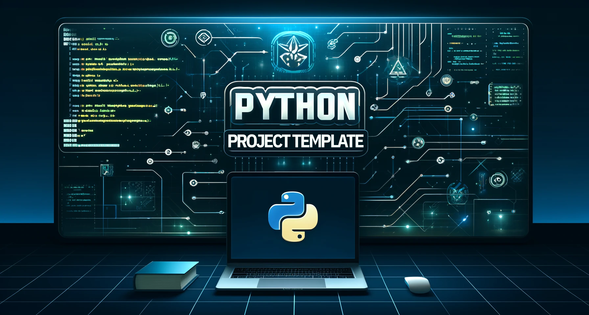

<h1 align="center">
RetroChem
</h1>

<br>


Final Project For Practical Programming in Chemistry

## ✨ Features

- **Name & Structure → SMILES**  
  Convert any common or IUPAC name *and* drawn molecular structure into a SMILES string in one click.

- **Rule-based Retrosynthesis**  
  Match your target SMILES against a hand-written SMARTS library of fundamental organic disconnections to suggest possible reactants.

- **Curated Organic Chemistry Database**  
  Includes all the core reactions you learn in your bachelor’s curriculum—esters, amides, acetals, ketone hydrations, reductions, and more.

- **Custom Database Support**  
  Drop your own `.db` (SMARTS) file into the project root and load it at runtime to extend or override the default reaction set.


## 🔥 Usage

```python
from mypackage import main_func

# One line to rule them all
from functions.py import name_to_smiles, structure_to_smiles, canonicalize_smiles
from retrochem.reaction_database reverse_reaction_generator, register_database, list_reactants

## 👩‍💻 Installation

Create a new environment, you may also give the environment a different name. 

```
conda create -n retrochem python=3.10 
```

```
conda activate retrochem
(conda_env) $ pip install .
```

If you need jupyter lab, install it 

```
(retrochem) $ pip install jupyterlab
```


## 🛠️ Development installation

Initialize Git (only for the first time). 

Note: You should have create an empty repository on `https://github.com:MajdTannous3579/RetroChem`.

```
git init
git add * 
git add .*
git commit -m "Initial commit" 
git branch -M main
git remote add origin git@github.com:MajdTannous3579/RetroChem.git 
git push -u origin main
```

Then add and commit changes as usual. 

To install the package, run

```
(retrochem) $ pip install -e ".[test,doc]"
```

### Run tests and coverage

```
(conda_env) $ pip install tox
(conda_env) $ tox