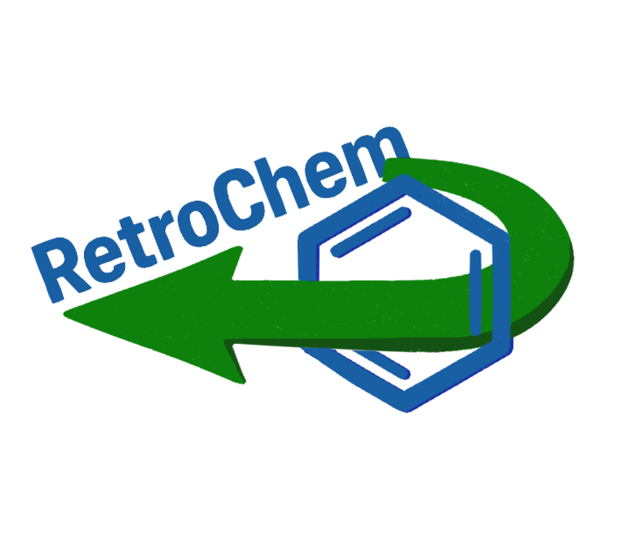

<h1 align="center">
RetroChem - Your guide for retro-organic chemistry
</h1>

<br>


Final Project For Practical Programming in Chemistry by Fatima A. Majd T. and Serena B.
Retrochem is a python package and applet, based especially on rdkit and Streamlit, providing functions, databases and interface to give possible retrosynthesis routes for a molecule.

## ✨ Features

- **Name & Structure → SMILES**  
  Convert any common or IUPAC name *and* drawn molecular structure into a SMILES string in one click.

- **Rule-based Retrosynthesis**  
  Match your target SMILES against a hand-written SMARTS library of fundamental organic disconnections to suggest possible reactants.

- **Curated Organic Chemistry Databases**  
  "epfl_student.db" Includes all the core reactions you learn in your bachelor’s curriculum—esters, amides, acetals, ketone hydrations, reductions, and more.
  "data_mol.db" comes from an open source online database, and includes more specific medicinal chemistry reactions and heterocycle construction. more details on their repository: https://github.com/datamol-io/datamol

- **Custom Database Support**  
  Create or edit your own `.db` (SMARTS and conditions) file into the project root and load it at runtime to extend or override the default reaction set.

More Details in the report.ipnyb document 


## 👩‍💻 Installation

Start by cloning the RetroChem Repository

$ git clone https://github.com/MajdTannous3579/RetroChem

Next, you'll have to install the module with all of its dependencies. Create a new environment, you may also give the environment a different name. 

```
conda create -n retrochem python=3.10 
```

Now, making sure your terminal is on the root folder of the project, which contains pyproject.toml and the src folder, you can run the following command:

```
conda activate retrochem
(conda_env) $ pip install -e.
```

if you would like to run the pytest functions, you should also install the corresponding dependencies:

$ pip install -e. [test]

Retrochem should now be present in your environment, you can use all of our project's functions by importing them in your python files:

from retrochem import ...

And you can also use the app by directing your terminal to the src\retrochem folder and running:

Streamlit run app.py

## 🛠️ Development installation

Initialize Git (only for the first time). 

Note: You should have create an empty repository on `https://github.com:MajdTannous3579/RetroChem`.

```
git init
git add * 
git add .*
git commit -m "Initial commit" 
git branch -M main
git remote add origin git@github.com:MajdTannous3579/RetroChem.git 
git push -u origin main
```

Then add and commit changes as usual. 

To install the package, run

```
(retrochem) $ pip install -e ".[test,doc]"
```

### Run tests and coverage

```
(conda_env) $ pip install tox
(conda_env) $ tox
``` 

### Contribution from each team member:

Fatima Abdoun: Coded the frontend (app.py), coded the test files, coded preliminary_fonctions 
Serena bouchaaya: Wrote most of report and readme, built the epfl_student handmade database.
Majd Tannous: Set up package structure and environment, Coded the backend (parsing_database, reaction_database), set up licenses and drew logo with photoshop(logo.png).

All team members participated in the preparation of the final presentation.